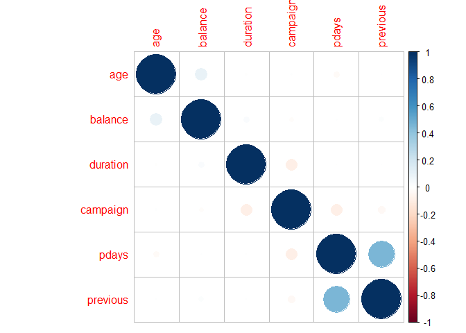
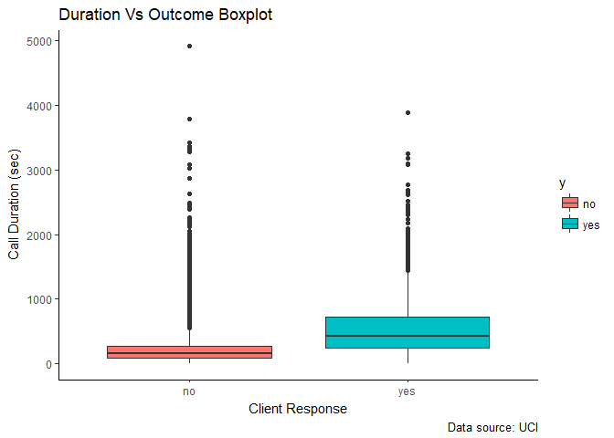
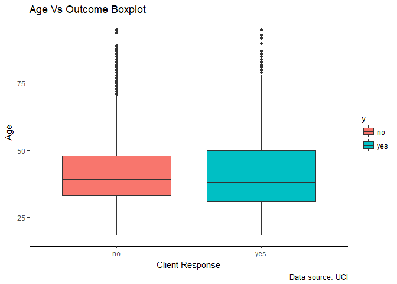
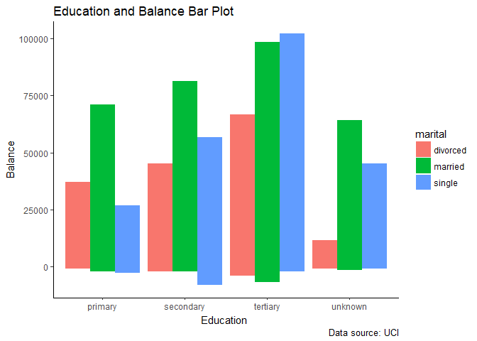
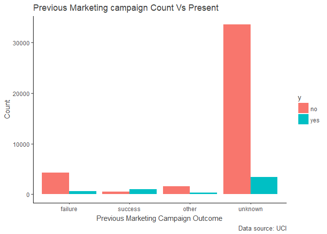
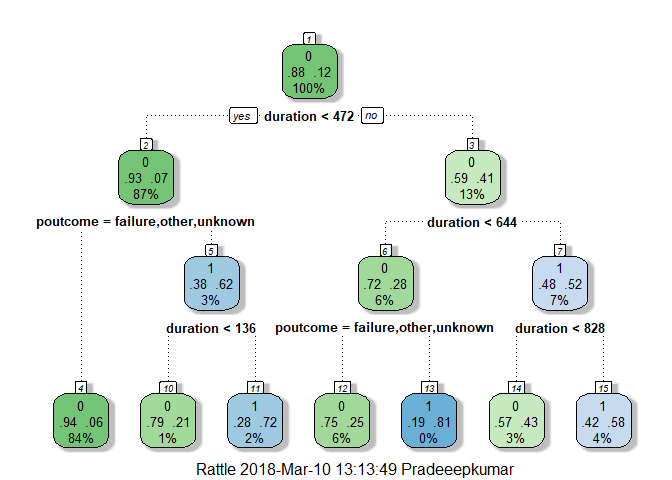
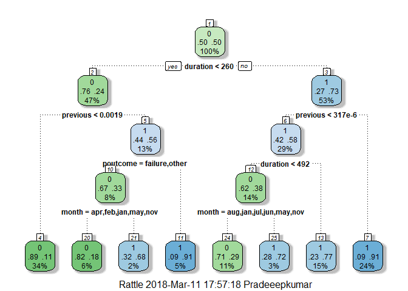
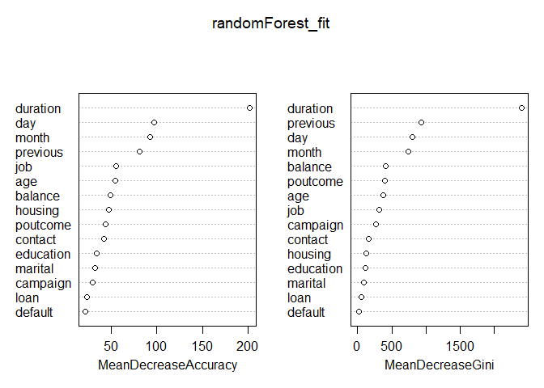

##Summary

Our [dataset](https://archive.ics.uci.edu/ml/datasets/bank+marketing) is related with direct marketing campaigns of a Portuguese banking institution. The marketing campaigns were based on phone calls. Our objective here is to analyze and find the important feature which leads to the **product (bank term deposit) subscription** so our bank can optimize the future marketing campaigns.

In short, our objective is **to predict whether the customer will subscribe to our marketing campaign** - [Classification Problem](https://en.wikipedia.org/wiki/Statistical_classification). Here we also face [Class Imbalance problem](http://www.chioka.in/class-imbalance-problem/) - Our dependent variable is *not equally distributed*, the number of customer who subscribed our campaign are very less when compared to the other, this often lead to the [Accuracy Paradox Problem](https://en.wikipedia.org/wiki/Accuracy_paradox), if our model blindly predict all of our customer will not subscribe we will have our *Accuracy Score closely to 88%*. Below let's see how can we overcome such problem and build a model which can effectively predict the future or unseen data.


```r
library(tidyverse)
library(rpart)
library(rattle)
library(rpart.plot)
library(RColorBrewer)
library(caret)
library(randomForest)
library(DMwR)
library(corrplot)
library(pROC)
library(ROCR)
library(forcats)
library(knitr)
library(kableExtra)
```

##Exploratory Data Analysis

###Data

You can download this [Dataset](https://archive.ics.uci.edu/ml/datasets/bank+marketing) UCI Machine Learning Repository. Here I'm going to follow the [Tidyverse](https://www.tidyverse.org/) way for the analysis. 


```r
setwd('C:/Users/Pradeeepkumar/Documents/Projects/TermDepositSubscriptionPrediction')
market_data<-read_delim('bank-full.csv', delim=';')
glimpse(market_data)
```

```
## Observations: 45,211
## Variables: 17
## $ age       <int> 58, 44, 33, 47, 33, 35, 28, 42, 58, 43, 41, 29, 53, ...
## $ job       <chr> "management", "technician", "entrepreneur", "blue-co...
## $ marital   <chr> "married", "single", "married", "married", "single",...
## $ education <chr> "tertiary", "secondary", "secondary", "unknown", "un...
## $ default   <chr> "no", "no", "no", "no", "no", "no", "no", "yes", "no...
## $ balance   <int> 2143, 29, 2, 1506, 1, 231, 447, 2, 121, 593, 270, 39...
## $ housing   <chr> "yes", "yes", "yes", "yes", "no", "yes", "yes", "yes...
## $ loan      <chr> "no", "no", "yes", "no", "no", "no", "yes", "no", "n...
## $ contact   <chr> "unknown", "unknown", "unknown", "unknown", "unknown...
## $ day       <int> 5, 5, 5, 5, 5, 5, 5, 5, 5, 5, 5, 5, 5, 5, 5, 5, 5, 5...
## $ month     <chr> "may", "may", "may", "may", "may", "may", "may", "ma...
## $ duration  <int> 261, 151, 76, 92, 198, 139, 217, 380, 50, 55, 222, 1...
## $ campaign  <int> 1, 1, 1, 1, 1, 1, 1, 1, 1, 1, 1, 1, 1, 1, 1, 1, 1, 1...
## $ pdays     <int> -1, -1, -1, -1, -1, -1, -1, -1, -1, -1, -1, -1, -1, ...
## $ previous  <int> 0, 0, 0, 0, 0, 0, 0, 0, 0, 0, 0, 0, 0, 0, 0, 0, 0, 0...
## $ poutcome  <chr> "unknown", "unknown", "unknown", "unknown", "unknown...
## $ y         <chr> "no", "no", "no", "no", "no", "no", "no", "no", "no"...
```

After you had a glimpse at our dataset you can see that all our character variables must be converted into factor. Apart from that day is also converted into factor.


```r
market_data <- market_data %>% mutate_if(is.character,as.factor)
market_data$day <- as.factor(market_data$day)
glimpse(market_data)
```

```
## Observations: 45,211
## Variables: 17
## $ age       <int> 58, 44, 33, 47, 33, 35, 28, 42, 58, 43, 41, 29, 53, ...
## $ job       <fct> management, technician, entrepreneur, blue-collar, u...
## $ marital   <fct> married, single, married, married, single, married, ...
## $ education <fct> tertiary, secondary, secondary, unknown, unknown, te...
## $ default   <fct> no, no, no, no, no, no, no, yes, no, no, no, no, no,...
## $ balance   <int> 2143, 29, 2, 1506, 1, 231, 447, 2, 121, 593, 270, 39...
## $ housing   <fct> yes, yes, yes, yes, no, yes, yes, yes, yes, yes, yes...
## $ loan      <fct> no, no, yes, no, no, no, yes, no, no, no, no, no, no...
## $ contact   <fct> unknown, unknown, unknown, unknown, unknown, unknown...
## $ day       <fct> 5, 5, 5, 5, 5, 5, 5, 5, 5, 5, 5, 5, 5, 5, 5, 5, 5, 5...
## $ month     <fct> may, may, may, may, may, may, may, may, may, may, ma...
## $ duration  <int> 261, 151, 76, 92, 198, 139, 217, 380, 50, 55, 222, 1...
## $ campaign  <int> 1, 1, 1, 1, 1, 1, 1, 1, 1, 1, 1, 1, 1, 1, 1, 1, 1, 1...
## $ pdays     <int> -1, -1, -1, -1, -1, -1, -1, -1, -1, -1, -1, -1, -1, ...
## $ previous  <int> 0, 0, 0, 0, 0, 0, 0, 0, 0, 0, 0, 0, 0, 0, 0, 0, 0, 0...
## $ poutcome  <fct> unknown, unknown, unknown, unknown, unknown, unknown...
## $ y         <fct> no, no, no, no, no, no, no, no, no, no, no, no, no, ...
```

Luckily, we don't have NA's in our Data Set. Check total number of NA's for all our variables.


```r
colSums(is.na(market_data))
```

```
##       age       job   marital education   default   balance   housing 
##         0         0         0         0         0         0         0 
##      loan   contact       day     month  duration  campaign     pdays 
##         0         0         0         0         0         0         0 
##  previous  poutcome         y 
##         0         0         0
```
Using skim function, we can easily skim through the distribution of our numeric variable.


```r
market_data %>% select_if(is.numeric) %>% skimr::skim()
```


###Variables correlation plot

Calculate the Correlation score of all numeric independent variables. We can see **pdays and previous** variables have the high correlation score of **0.44**. To avoid [multi-collinearity problem](http://www.statisticssolutions.com/multicollinearity/) it's advisable to remove one of the variables while building our model, so *pdays* is removed from our dataset.


```r
market_data %>% select_if(is.numeric) %>% cor() %>% corrplot(method = 'circle')
```

<!-- -->

```r
market_data<- subset(market_data, select = -c(pdays))
```

###EDA Plots


```r
ggplot() + 
  geom_boxplot(data=market_data, aes(x=y, y=duration, fill=y))+
  labs(title = "Duration Vs Outcome Boxplot")+
  labs(x = "Client Response", y = "Call Duration (sec)",caption = "Data source: UCI")+theme_classic()
```

<!-- -->


```r
ggplot() + 
  geom_boxplot(data=market_data, aes(x=y, y=age, fill=y))+
  labs(title = "Age Vs Outcome Boxplot")+
  labs(x = "Client Response", y = "Age",caption = "Data source: UCI")+theme_classic()
```

<!-- -->


```r
ggplot() + 
  geom_bar(data=market_data, aes(x=education  , y=balance, fill=marital),stat = "identity", position = "dodge")+
  labs(title = "Education and Balance Bar Plot")+
  labs(x = "Education ", y = "Balance",caption = "Data source: UCI")+theme_classic()
```

<!-- -->

Here new function [fct_relevel](https://www.rdocumentation.org/packages/forcats/versions/0.2.0/topics/fct_relevel) function is used to relevel our categorical variables for easy understanding of our plot.


```r
ggplot(market_data, aes(x = fct_relevel(poutcome,'failure','success','other','unknown'), fill = y)) + geom_bar(stat="count",position = "dodge")+
  labs(title = "Previous Marketing campaign Count Vs Present")+
  labs(x = "Previous Marketing Campaign Outcome", y='Count',caption = "Data source: UCI")+theme_classic()+  theme(
    text = element_text(
      color = "gray25")
  )
```

<!-- -->


##Model Preparation

Here to show the effects of **Class Imbalance Problem** we are going to run our Decision Tree model twice - Before solving Class Imbalance and After

###Before SMOTE 

'no' and 'yes' from our dependent variables are recoded as 0 and 1. The distribution of Customer Subscribed is **11.7%** and Customer not Subscribed is **88.3%**


```r
levels(market_data$y) <- c("0", "1")
round(prop.table(table(market_data$y))*100,2)
```

```
## 
##    0    1 
## 88.3 11.7
```

Set seed and split into train and test set - train (70% of data) and test (30% of data)


```r
set.seed(1234)
splitIndex <- createDataPartition(market_data$y, p = .70,
                                  list = FALSE, times = 1)
trainSplit <- market_data[ splitIndex,]
testSplit <- market_data[-splitIndex,]
```

Proportion of response variable(y) in Training dataset before SMOTE


```r
round(prop.table(table(trainSplit$y)),2)
```

```
## 
##    0    1 
## 0.88 0.12
```

#### Decision Tree Classifier Before SMOTE

Decision Tree chooses its split based on the Highest Information gain received from each split which in turn results in more homogeneous leaf nodes. From this tree we can find **duration and poutcome** are important variables


```r
fit_1 <- rpart(y ~ .,
             data=trainSplit,
             method="class")

fancyRpartPlot(fit_1)
```

<!-- -->

```r
Prediction_1 <- predict(fit_1, testSplit, type = "class")
```

Confusion Matrix Before SMOTE - Here we can see that our Recall score is very less when compared to the precision score, our main objective is to boost our Recall score because we are concerned about predicting the customer who will subscribe and our model should also give better F1 score.


```r
DT_Before_CM<- confusionMatrix(Prediction_1, testSplit$y,positive ='1',mode = "prec_recall")
DT_Before_CM
```

```
## Confusion Matrix and Statistics
## 
##           Reference
## Prediction     0     1
##          0 11660  1053
##          1   316   533
##                                           
##                Accuracy : 0.8991          
##                  95% CI : (0.8939, 0.9041)
##     No Information Rate : 0.8831          
##     P-Value [Acc > NIR] : 1.783e-09       
##                                           
##                   Kappa : 0.3879          
##  Mcnemar's Test P-Value : < 2.2e-16       
##                                           
##               Precision : 0.6278          
##                  Recall : 0.3361          
##                      F1 : 0.4378          
##              Prevalence : 0.1169          
##          Detection Rate : 0.0393          
##    Detection Prevalence : 0.0626          
##       Balanced Accuracy : 0.6548          
##                                           
##        'Positive' Class : 1               
## 
```

###After SMOTE

[SMOTE](https://arxiv.org/pdf/1106.1813.pdf) is used to solve the Class Imbalance problem. Basic objective is to  come up with the proportion of 50-50 for negative and positive cases. That can be achieved by up sampling the positive class and down sampling our negative class, a hybrid approach. Here we set perc.over = 100 to double (Up Sample) the quantity of positive cases, and set perc.under=200 (Down sample) the negative cases.


```r
trainSplit<-as.data.frame(trainSplit)
trainSplit_smote <- SMOTE(y ~ ., trainSplit, perc.over = 100, perc.under=200)
```

Proportion of response variable in Train dataset after SMOTE. Our 50-50 dream is achieved.


```r
round(prop.table(table(trainSplit_smote$y)),2)
```

```
## 
##   0   1 
## 0.5 0.5
```

####Decision Tree Classifier After SMOTE

From this tree we can find **duration and previous** are important variables


```r
fit_2 <- rpart(y ~ .,
             data=trainSplit_smote,
             method="class")
#, control = rpart.control(maxdepth=3)

fancyRpartPlot(fit_2)
```

<!-- -->

```r
Prediction_2 <- predict(fit_2, testSplit, type = "class")
```

Confusion Matrix After SMOTE - Here we can see the increase in our Recall score and F-1 score. This shows that our objectives are met.Run advanced models to see if you can further increase the F-1 score.


```r
DT_After_CM<-confusionMatrix(Prediction_2, testSplit$y,positive = '1', mode = "prec_recall")
DT_After_CM$byClass
```

```
##          Sensitivity          Specificity       Pos Pred Value 
##           0.75283733           0.84210087           0.38703404 
##       Neg Pred Value            Precision               Recall 
##           0.96258471           0.38703404           0.75283733 
##                   F1           Prevalence       Detection Rate 
##           0.51123956           0.11694440           0.08804011 
## Detection Prevalence    Balanced Accuracy 
##           0.22747382           0.79746910
```

####Random Forest Classifier After SMOTE


```r
randomForest_fit <- randomForest(y ~ .,
             data=trainSplit_smote,importance=TRUE,
             method="class")

Prediction_3 <- predict(randomForest_fit, testSplit, type = "class")
```

Again, we can see an increase in our Recall and F1 Score. A significant increase when compared to Before SMOTE part. This clearly shows how solving Class-Imbalance can significantly improve our model performance.


```r
RF_After_CM<-confusionMatrix(Prediction_3, testSplit$y,positive = '1', mode = "prec_recall")
RF_After_CM
```

```
## Confusion Matrix and Statistics
## 
##           Reference
## Prediction    0    1
##          0 9873  166
##          1 2103 1420
##                                           
##                Accuracy : 0.8327          
##                  95% CI : (0.8263, 0.8389)
##     No Information Rate : 0.8831          
##     P-Value [Acc > NIR] : 1               
##                                           
##                   Kappa : 0.4705          
##  Mcnemar's Test P-Value : <2e-16          
##                                           
##               Precision : 0.4031          
##                  Recall : 0.8953          
##                      F1 : 0.5559          
##              Prevalence : 0.1169          
##          Detection Rate : 0.1047          
##    Detection Prevalence : 0.2598          
##       Balanced Accuracy : 0.8599          
##                                           
##        'Positive' Class : 1               
## 
```

By considering varImpPlot we can get an idea about important variables detected by our RandomForest model. From our RF model and DT model we can confirm that **duration and previous** are our important variables.


```r
varImpPlot(randomForest_fit)
```

<!-- -->

##Model Comparision

The below table clearly shows the performance of our models with respect to F1, Recall and Accuracy Scores


```r
models_table <- data.frame(models=c("Decision Tree Before SMOTE","Decision Tree After SMOTE","Random Forest After SMOTE"),
                        F1_Score=c(DT_Before_CM$byClass['F1'],DT_After_CM$byClass['F1'],
                                       RF_After_CM$byClass['F1']),
                        Recall_Score=c(DT_Before_CM$byClass['Recall'],DT_After_CM$byClass['Recall'],
                                       RF_After_CM$byClass['Recall']),
                        Accuracy_Score=c(DT_Before_CM$overall['Accuracy'],DT_After_CM$overall['Accuracy'],
                                     RF_After_CM$overall['Accuracy']))
models_table <- models_table %>% remove_rownames %>% column_to_rownames(var="models")

kable(models_table, "html") %>% kable_styling(bootstrap_options = c("striped", "hover", "condensed", "responsive")) %>% column_spec(1, width = "8cm")
```

<table class="table table-striped table-hover table-condensed table-responsive" style="margin-left: auto; margin-right: auto;">
 <thead>
  <tr>
   <th style="text-align:left;">   </th>
   <th style="text-align:right;"> F1_Score </th>
   <th style="text-align:right;"> Recall_Score </th>
   <th style="text-align:right;"> Accuracy_Score </th>
  </tr>
 </thead>
<tbody>
  <tr>
   <td style="text-align:left;width: 8cm; "> Decision Tree Before SMOTE </td>
   <td style="text-align:right;"> 0.4377823 </td>
   <td style="text-align:right;"> 0.3360656 </td>
   <td style="text-align:right;"> 0.8990562 </td>
  </tr>
  <tr>
   <td style="text-align:left;width: 8cm; "> Decision Tree After SMOTE </td>
   <td style="text-align:right;"> 0.5112396 </td>
   <td style="text-align:right;"> 0.7528373 </td>
   <td style="text-align:right;"> 0.8316620 </td>
  </tr>
  <tr>
   <td style="text-align:left;width: 8cm; "> Random Forest After SMOTE </td>
   <td style="text-align:right;"> 0.5558818 </td>
   <td style="text-align:right;"> 0.8953342 </td>
   <td style="text-align:right;"> 0.8326943 </td>
  </tr>
</tbody>
</table>

##Recommendation

* Duration has a positive effect on our outcome, the longer customer spends with a particular product, the more likely they are to be interested in using the product, so there are higher chances that they will opt for our services

* During the next campaign if we see customer spends more time, special attention and remarketing strategies must be implemented to make sure customer opts for the service

* Apart from that we can concentrate on the customers whose previous campaign outcome is success, they also have good chances of becoming our bank's customer
